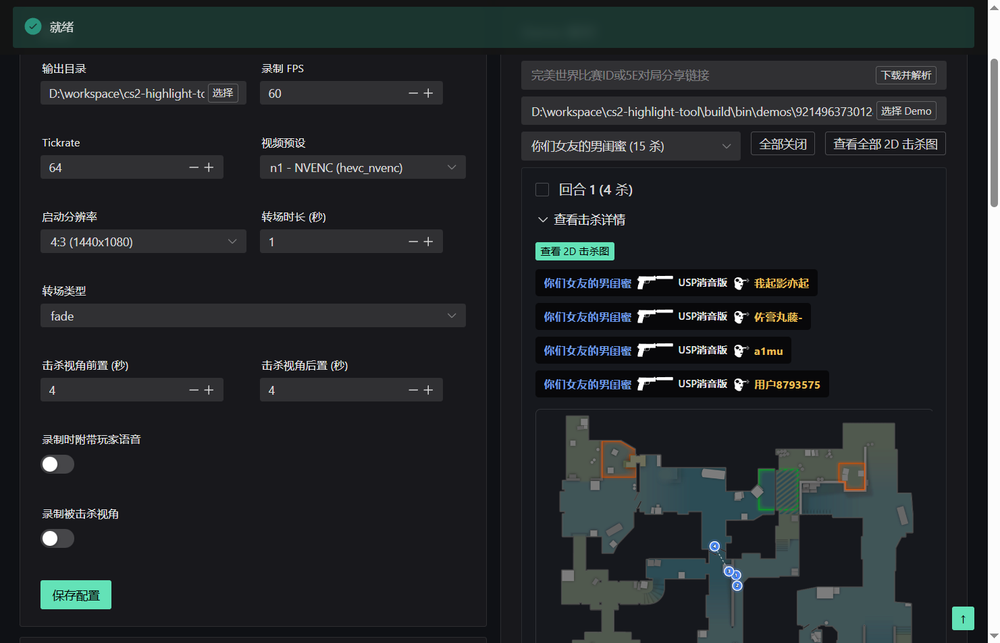

<p align="center">
  
</p>

<h1 align="center"> CS2 Highlight Tool - Your CS2 Kill Highlight Generator</h1>

<p align="center">
  English | <a href="README.md">简体中文</a>
</p>

<p align="center">
  <a href="https://github.com/hkslover/cs2-highlight-tool/releases"></a>
  <a href="https://github.com/hkslover/cs2-highlight-tool/releases"></a>
  
</p>

# Previews


---

## 🎯 Development Background

As a passionate CS2 player in China, have you ever experienced these frustrations: 😤

- When using the Perfect World platform, you only have **2** chances per week to generate "Perfect Moments", which is far from enough
- Eager to share your amazing plays with friends, only to find out you've already used up this week's generation quota

**Thus, this project was born!** 🎉

CS2 Highlight Tool allows you to:
- ✅ Generate kill highlight reels **unlimited times**, as many as you want
- ✅ Have **full control** over recording parameters and transition effects
- ✅ Ensure **privacy and security**, with all data processed locally

Say goodbye to quota anxiety, and let every amazing (or even goofy) play be worth recording! 📹

---

## 🚀 Project Introduction

A **CS2 Demo kill highlight creation tool** built with **Wails + Vue + Naive UI**!  
Parse game demo files → Select epic rounds → Automatically generate kill highlight reels — from now on, highlight moments are defined by you! 💥

---
## TODO
- ✅  **Multi-language Support**
- ✅  **Support for Player Voice Recording**
- ✅  **2D Kill Render**
- [ ]  **Customizable CFG Recording**
- [ ]  **Sharing Community**

Updates as I feel like it.

---

## ✨ Why Choose Me?

| Feature | CS2 Highlight Tool (🥇 Perfect Little Tool) | CS Demo Manager (Too Professional) | ClutchKings (Limited by Network Issues) |
|------|----------------------|------------------|-------------|
| **Privacy Protection** | 🏠 Entirely local operation | Local operation | Cloud-dependent |
| **Ease of Use** | ⚡ Auto-configures environment, one-click editing | Requires manual dependency installation | Requires foreign network access |
| **Customization Level** | 🎛️ Full control over recording parameters, CFG, transition effects | Limited customization | Templated |
| **User Experience** | 🎮 Simple and intuitive | Professional but complex features | Relatively intuitive |

---

## 🛠️ Installation & Usage

### Method One: For Lazy People (Recommended 🌟)
Go directly to the [Release page](https://github.com/hkslover/cs2-highlight-tool/releases) to download the `.exe` file, double-click and run! 🚀

### Method Two: For Geeks
If you prefer starting from source code:

```bash
#   Prerequisites
#   - Go 1.22+
#   - Node.js 18+
#   - Wails CLI


git clone https://github.com/hkslover/cs2-highlight-tool
cd CS2-Highlight-Tool
wails dev 

wails build --clean --platform windows/amd64
```

---

## 🎮 Usage Process

1. **Launch the app** → Automatically downloads and configures HLAE, FFmpeg
2. **Set CS2 path** → Tell the tool where your game is hidden 🎯
3. **Select Demo file**
4. **Check highlight rounds** → "This ace must be in the highlight reel!" ✔️
5. **Generate and preview** → Wait for the magic to happen, then show off! 🎥✨

**🎉 From now on, you never have to worry about:**
- "I've used up this week's quota, what about my next ace?"
- "That last clutch was so sick, but I have no more saves left..."
- "I want to make a season highlight reel, but the platform doesn't support it"

---

## 🙏 Special Thanks

This project is powerful thanks to the support of the following open-source projects (in no particular order):

- [advancedfx/advancedfx (HLAE)](https://github.com/advancedfx/advancedfx)
- [demoinfocs-golang](https://github.com/markus-wa/demoinfocs-golang)
- [FFmpeg](https://ffmpeg.org/)
- [Purple-CSGO](https://github.com/Purple-CSGO/)
- [wails](https://wails.io/)

---

*"Let every brilliant moment be unrestricted, be unforgotten."* 🎯

> 💡 **Tip**: If you find it useful, don't forget to give a Star ⭐ so **more CS2 players** can see it!  
> Questions or suggestions? Feel free to submit an Issue or join the discussion!  
> **Let's break the limits and create unlimited highlights together!**