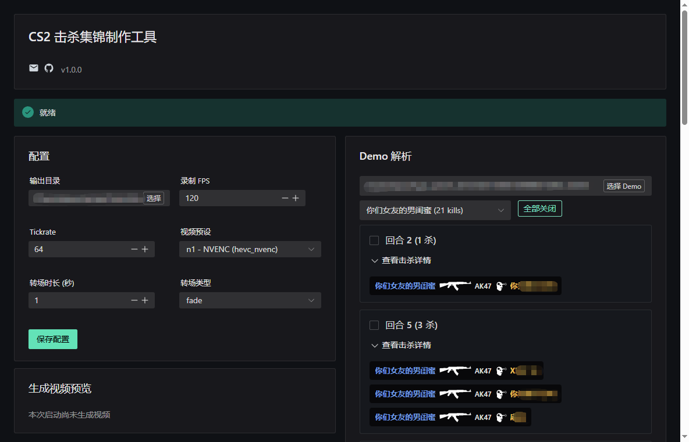

# 🎬 CS2 Highlight Tool - 你的CS2击杀集锦生成器

> 每周仅2次"完美时刻"不够用？🤯 打破限制，无限生成你的高光集锦！✨



---

## 🎯 开发背景

作为一个热爱CS2的国内玩家，你是否也经历过这些烦恼：😤

- 使用完美对战平台时，每周仅有 **2次** "完美时刻"生成机会，根本不够用
- 渴望将精彩操作集锦分享给基友，却发现这周生成次数已经用完

**于是，这个项目诞生了！** 🎉

CS2 Highlight Tool 让你：
- ✅ **无限次**生成击杀集锦，想剪多少就剪多少
- ✅ **完全掌控**录制参数和转场效果
- ✅ **隐私安全**，所有数据都在本地处理

告别次数焦虑，让每一场精彩（唐氏）操作都值得被记录！📹

---

## 🚀 项目简介

一个基于 **Wails + Vue + Naive UI** 打造的 **CS2 Demo 击杀集锦制作工具**！  
解析游戏 demo 文件 → 挑选炫酷回合 → 自动生成击杀集锦 —— 从此高光时刻，由你定义！💥


---
## TODO
- [ ]  **多语言支持**
- [ ]  **客制化CFG录制**
- [ ]  **分享社区**

随缘更新

---

## ✨ 为什么选择我？

| 特性 | CS2 Highlight Tool （🥇完美小工具） | CS Demo Manager（过于专业） | ClutchKings（受限于网络问题） |
|------|----------------------|------------------|-------------|
| **隐私保护** | 🏠 全程本地运行 | 本地运行 | 云端依赖 |
| **上手难度** | ⚡ 自动配置环境，一键开剪 | 需要手动安装依赖 | 需要外网访问 |
| **定制程度** | 🎛️ 录制参数、CFG、转场效果完全可控 | 有限定制 | 模板化 |
| **使用体验** | 🎮 简单直观 | 功能专业繁杂 | 较直观 |

---

## 🛠️ 安装与运行

### 方法一：懒人专属（推荐🌟）
直接前往 [Release 页面](https://github.com/你的仓库地址/releases) 下载 `.exe` 文件，双击即用！🚀

### 方法二：极客模式
如果你喜欢从源码开始：

```bash
#   安装必备环境
#   - Go 1.22+
#   - Node.js 18+
#   - Wails CLI


git clone https://github.com/hkslover/cs2-highlight-tool
cd CS2-Highlight-Tool
wails dev 

wails build --clean --platform windows/amd64
```

---

## 🎮 使用流程

1. **启动应用** → 自动下载配置 HLAE、FFmpeg
2. **设置 CS2 路径** → 告诉工具你的游戏藏在哪 🎯
3. **选择 Demo 文件**
4. **勾选高光回合** → "这波五杀必须放进集锦！" ✔️
5. **生成并预览** → 等待魔法发生，然后秀翻全场！ 🎥✨

**🎉 从此，你再也不用担心：**
- "这周次数用完了，下个五杀怎么办？"
- "刚才那波残局太帅了，但没次数保存了..."
- "想做个赛季集锦，但平台不支持"

---

## 🙏 特别鸣谢

本项目之所以强大，离不开以下开源项目的支持（不分先后）：

- [advancedfx/advancedfx (HLAE)](https://github.com/advancedfx/advancedfx)
- [demoinfocs-golang](https://github.com/markus-wa/demoinfocs-golang)
- [FFmpeg](https://ffmpeg.org/)
- [Purple-CSGO](https://github.com/Purple-CSGO/)
- [wails](https://wails.io/)

---


*"让每一个精彩瞬间，都不被限制，不被辜负。"* 🎯


> 💡 **小提示**：如果觉得好用，别忘了点个 Star ⭐ **让更多CS2玩家**看到！  
> 有问题或建议？欢迎提交 Issue 或加入讨论！  
> **一起打破限制，创造无限精彩！** 