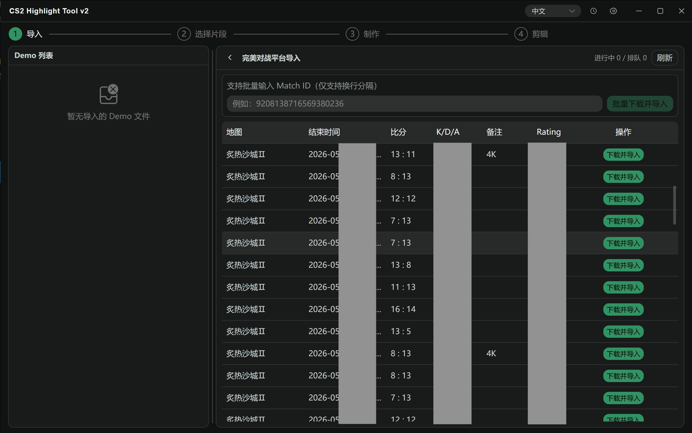
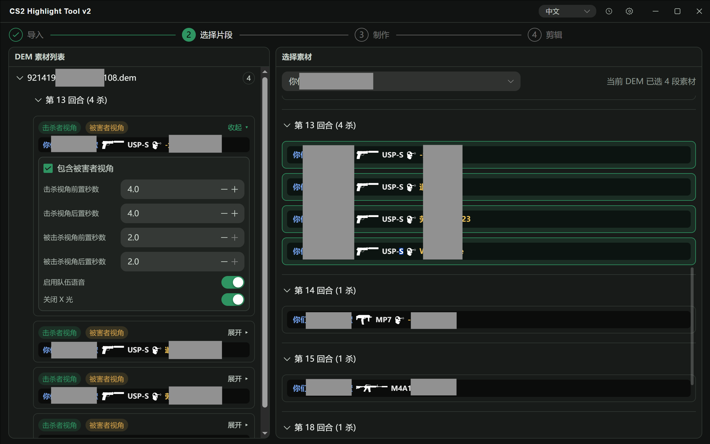
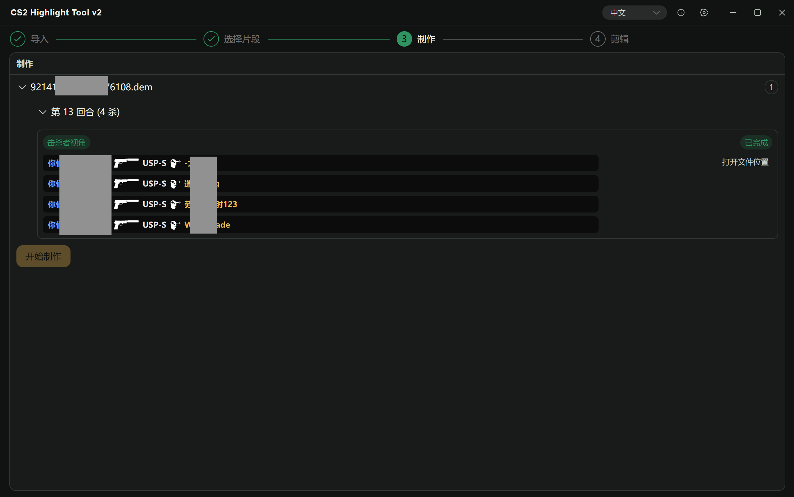
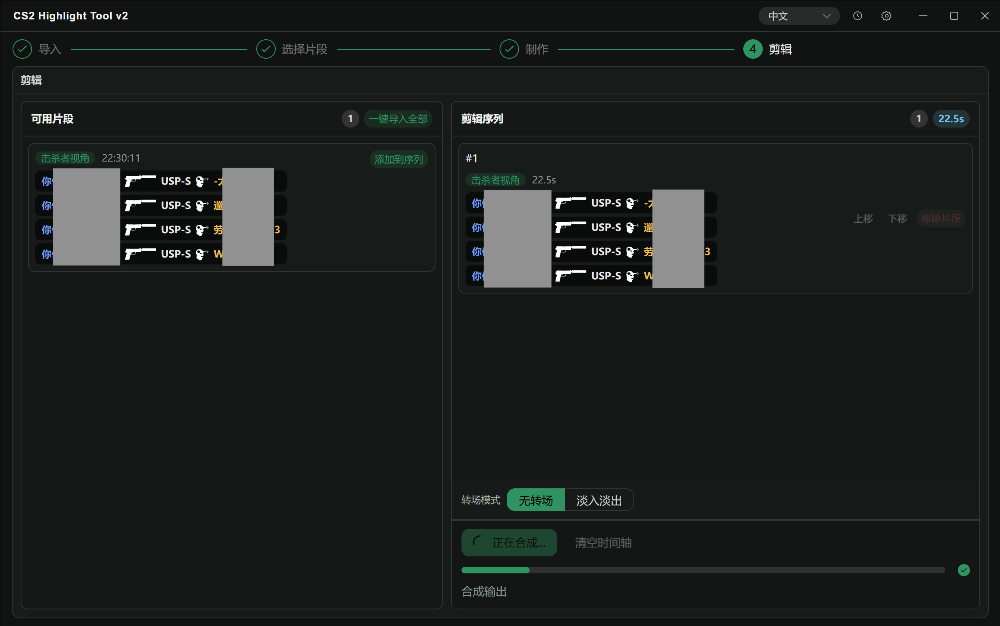

  
  <h1>CS2 Highlight Tool</h1>
  
CS2 Demo 导入、片段选择、录制制作与后期拼接的一体化桌面工具。

  

    
    
  

  

    <a href="https://cs2.snowblog.xyz">官网</a> ·
    <a href="https://github.com/hkslover/cs2-highlight-tool-v2/releases">下载 Releases</a> ·
    <a href="#quickstart">快速开始</a> ·
    <a href="#dev">我是开发者</a> ·
  

## 导航

- [软件截图](#screenshots)
- [核心功能](#features)
- [我是用户](#quickstart)
- [我是开发者](#dev)
- [特别鸣谢](#thanks)

## 软件截图

### 导入页面

### 选择片段

### 制作

### 剪辑

## 核心功能

| 模块 | 能力 |
| --- | --- |
| Demo 导入 | 支持本地文件导入、完美对战平台导入、5E 平台导入 |
| 片段选择 | 按玩家/回合筛选击杀片段，支持击杀者与被害者视角组合 |
| 制作录制 | 生成配置并驱动录制流程，提供实时状态与制作历史 |
| 后期剪辑 | 对已产出片段进行拼接导出，支持基础转场与时间线调整 |

## 快速开始（用户）

1. 前往 [Releases](https://github.com/hkslover/cs2-highlight-tool-v2/releases) 下载 Windows 可执行文件。
2. 启动软件，等待首次环境准备完成（必要时按提示修复组件）。
3. 在 `导入` 页面导入 DEM（本地 / 完美 / 5E）。
4. 在 `选择片段` 页面选择要制作的击杀片段与参数。
5. 在 `制作` 页面开始录制，完成后进入 `剪辑` 页面拼接导出。

## 本地开发（开发者）

先决条件（建议）：

- Go `1.24+`
- Node.js（建议 LTS）
- Wails CLI `v2`

常用命令：

| 场景 | 命令 |
| --- | --- |
| 开发模式 | `wails dev` |
| 构建产物 | `wails build` |
| 后端测试 | `go test ./...` |
| 前端构建校验 | `cd frontend && npm run build` |

## 特别鸣谢
排名不分先后
- [advancedfx/advancedfx (HLAE)](https://github.com/advancedfx/advancedfx)
- [demoinfocs-golang](https://github.com/markus-wa/demoinfocs-golang)
- [FFmpeg](https://ffmpeg.org/)
- [Purple-CSGO](https://github.com/Purple-CSGO/)
- [wails](https://wails.io/)
- [cs-demo-manager](https://github.com/akiver/cs-demo-manager)

---